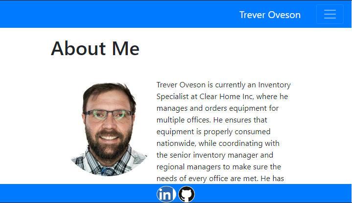

## Table of contents
* [Responsive-Portfolio](#Responsive-Portfolio)
* [Technologies](#Technologies)
* [Collaborators](#collaborators)
* [links](#links)
* [Responsive Portfolio Website](https://toveson.github.io/portfolio/)

# Responsive-Portfolio

This is a site built using Bootstrap to be responsive to the screen size bbeing used to view it. This was a challenging yet rewarding. While it was difficult to complete it was very rewarding when I finally got a part of code to work the way I wanted it after researching how to do something. 

## Technologies
* HTML
* Bootstrap

## Home-Page

this [responsive portfolio](https://toveson.github.io/portfolio/) is hosted on Github pages.

## Collaborators
This application was authored by [Trever Oveson](https://github.com/toveson).

## links
* I would also like to thank my wife, Tasha for helping me wite my about me and my friend, Phil who I bounced a lot of ideas off of.
* Last but not least some sites I used for the following
* https://brand.linkedin.com/downloads for linkedin image in footer
* https://github.com/logos for github image link in footer
* https://pixlr.com/x/ for resizing my picture

